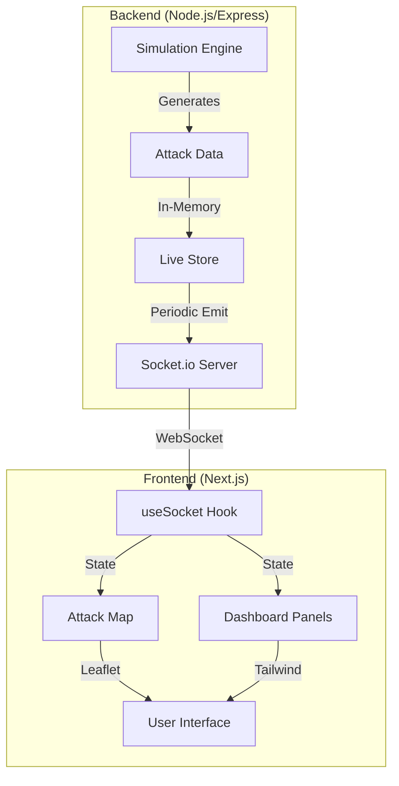

# 🌐 Live DDoS Threat Map

**A high-fidelity, real-time "War Room" visualization for network security monitoring.**

This project provides a professional-grade dashboard designed to visualize global network security threats. Using a real-time data pipeline, it transforms raw attack telemetry into an engaging geographic interface, simulating the environment of a Security Operations Center (SOC).

---

## ✨ Features

- **📍 Real-time Geographic Mapping**: Visualize attacks as they happen with animated markers and flight paths showing traffic from source to target.
- **📊 Live Attack Feed**: A scrolling high-speed terminal and list showing the most recent detected threats.
- **📈 Cumulative Statistics**: Real-time aggregation of total attacks, most targeted countries, and prevalent attack types.
- **🔥 Severity Indicators**: Dynamic styling based on attack intensity (Low, Medium, High, Critical).
- **🚀 Advanced Visualization**: Built with Leaflet and custom CSS animations for a smooth, "dark mode" aesthetic.
- **⚙️ Simulation Engine**: A backend engine that generates realistic threat intelligence data for demonstration purposes.

---

## 🛠️ Tech Stack

### Frontend
- **Framework**: [Next.js 15](https://nextjs.org/) (App Router)
- **Styling**: [Tailwind CSS 4](https://tailwindcss.com/)
- **Mapping**: [Leaflet](https://leafletjs.com/) & [React-Leaflet](https://react-leaflet.js.org/)
- **Real-time**: [Socket.io-client](https://socket.io/)

### Backend
- **Runtime**: Node.js
- **Server**: [Express](https://expressjs.com/)
- **Real-time**: [Socket.io](https://socket.io/)
- **Scheduling**: [Node-cron](https://www.npmjs.com/package/node-cron) for data generation loops.

### DevOps
- **Containerization**: [Docker](https://www.docker.com/) & Docker Compose

---

## 🏗️ System Architecture



---

## 🚦 Getting Started

### Prerequisites
- Node.js 20+
- Docker & Docker Compose (optional)

### Local Development

1. **Clone the repository**
   ```bash
   git clone https://github.com/your-username/live-ddos.git
   cd live-ddos
   ```

2. **Install Dependencies**
   ```bash
   # Root (Frontend)
   npm install
   
   # Backend
   cd backend
   npm install
   cd ..
   ```

3. **Environment Variables**
   Create a `.env` file in the `backend` directory:
   ```env
   PORT=8000
   FRONTEND_URL=http://localhost:3000
   ```

4. **Run the Application**
   ```bash
   # Start Backend (from backend directory)
   npm run dev
   
   # Start Frontend (from root directory)
   npm run dev
   ```

### Docker Deployment
Run the entire stack with a single command:
```bash
docker-compose up --build
```
Access the dashboard at `http://localhost:3000`.

---

## 📝 License
Distributed under the MIT License. See `LICENSE` for more information.
